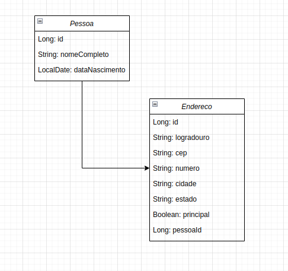

# Teste Técnico - Back End - Mão na Massa 🖐

### Feito com ❤️

Este código resolve o seguinte problema:

A API desenvolvida deve permitir: 

- Criar, editar e consultar uma ou mais pessoas;

- Criar, editar e consultar um ou mais endereços de uma pessoa;

- Poder indicar qual endereço será considerado o principal de uma pessoa.

## Diagrama de classes



## Endpoints de pessoas

### Criar pessoa

    POST 'http://localhost:8080/pessoas/criar'

    Para testar terá que enviar um json, por exemplo:

    ```
        {
            "nomeCompleto": "Dom Pedro I",
            "dataNascimento": "1798-10-12"
        }
    ```

    Esse endpoint está validando duplicidade caso tente inserir o mesmo nome e data de nascimento!

### Editar pessoa

    PUT 'http://localhost:8080/pessoas/editar/{id}'

    O id na url serve para identificar qual pessoa no banco você está alterando.
    Para testar terá que enviar um json, por exemplo:

    ```
        {
            "nomeCompleto": "Dom Pedro II",
            "dataNascimento": "1825-12-02"
        }
    ```

### Consultar uma pessoa

    GET 'http://localhost:8080/pessoas/consultar/{id}'

    Da mesma forma, deve passar na url o id da pessoa que quer consultar!

### Listar todas as pessoas

    GET 'http://localhost:8080/pessoas/consultar'

    Lista todas as pessoas cadastradas (Sem filtro)

## Endpoints de Endereços

### Consultar Endereços por Pessoa

    GET 'http://localhost:8080/enderecos/consultar/{idPessoa}'

    Lista todos os endereços cadastrados daquela pessoa!

### Consultar Endereço Principal por Pessoa

    GET 'http://localhost:8080/enderecos/consultar-principal/{idPessoa}'

    Retorna endereço principal cadastrado de uma pessoa

### Criar Endereço para Pessoa

    POST 'http://localhost:8080/enderecos/criar/{idPessoa}'

    O id na url serve para saber de qual pessoa é aquele endereço.

    Para testar terá que enviar um json, por exemplo:

    ```
        {
            "logradouro": "Rua Teste",
            "cep": "12345-678",
            "numero": "123",
            "cidade": "Cidade Teste",
            "estado": "Estado Teste"
        }
    ```

### Definir Endereço Principal

    PUT 'http://localhost:8080/enderecos/definir-principal/{idEndereco}'

    Esse endpoint define aquele endereço como principal para aquele usuário!

    Caso o usuário tenha algum endereço como principal antes, ele será alterado para deixar de ser o principal

### Editar Endereço

    PUT 'http://localhost:8080/enderecos/editar/{idEndereco}'

    ```
        {
            "logradouro": "Rua Teste alterado",
            "cep": "12345-678",
            "numero": "123",
            "cidade": "Cidade Teste alterado",
            "estado": "Estado Teste alterado"
        }
    ```